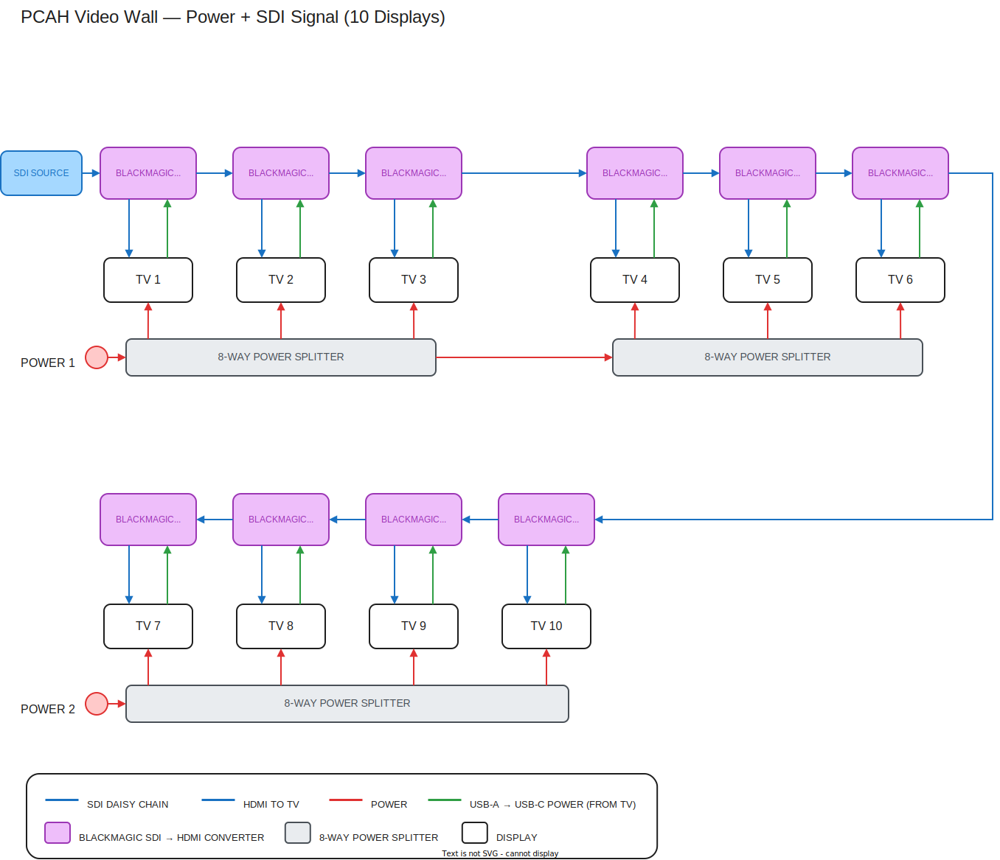

# PCAH Wiring Diagrams

The wiring diagram for the PCAH video wall: an SDI source daisy-chained through
a Blackmagic SDI→HDMI converter at each of 10 displays, arranged in three
clusters (3 top-left, 3 top-right, 4 below), with shared power distribution.

How each display is wired:

- **Red** — electric power from the wall feeds, through 8-way power splitters,
  to each TV.
- **Blue** — video: the SDI feed daisy-chained converter to converter through
  their SDI through ports, and the HDMI feed from each converter into its TV.
- **Green** — the USB-A → USB-C cable the converter uses to draw power from
  the TV; the arrowhead points into the converter to show that power draw.



**[Open in draw.io](https://app.diagrams.net/#Uhttps%3A%2F%2Fraw.githubusercontent.com%2Fstatik%2Fpcah-wiring-diagrams%2Fmain%2Fdiagrams%2Fpcah-video-wall.drawio)**
— edits a copy in the browser; use File → Save As to keep your changes. To edit
and commit straight back to this repo, use the
[GitHub-connected editor](https://app.diagrams.net/#Hstatik%2Fpcah-wiring-diagrams%2Fmain%2Fdiagrams%2Fpcah-video-wall.drawio)
(asks to authorize GitHub on first use).

**[Download the PNG](diagrams/pcah-video-wall.png?raw=true)** — the draw.io
diagram is embedded inside the PNG, so the image can be shared anywhere and
still opened for editing at [app.diagrams.net](https://app.diagrams.net).

## Formats and editing

**`diagrams/pcah-video-wall.drawio` is the source of truth.** Edit it with the
"Open in draw.io" link above (the GitHub-connected variant commits straight
back to this repo) or in the draw.io desktop app, then regenerate the derived
formats:

```sh
python3 export_diagrams.py
```

[export_diagrams.py](export_diagrams.py) derives everything else from the
`.drawio` file:

- **`pcah-video-wall.svg`** — rendered by the draw.io CLI; embedded above.
- **`pcah-video-wall.png`** — downloadable image with the draw.io diagram
  embedded, so the PNG itself can be opened for editing at app.diagrams.net.
- **`pcah-video-wall.excalidraw`** — converted from the draw.io XML for
  [excalidraw.com](https://excalidraw.com), VS Code (Excalidraw extension), or
  Obsidian users. Edits made in Excalidraw don't flow back — they'll be
  overwritten on the next export, so lasting changes belong in the `.drawio`.

The SVG/PNG steps need the [draw.io desktop app](https://www.drawio.com)
installed; the Excalidraw conversion runs anywhere (Python 3, standard library
only).
