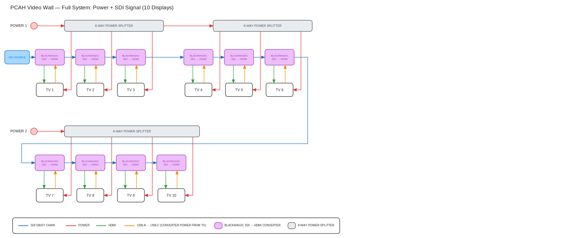
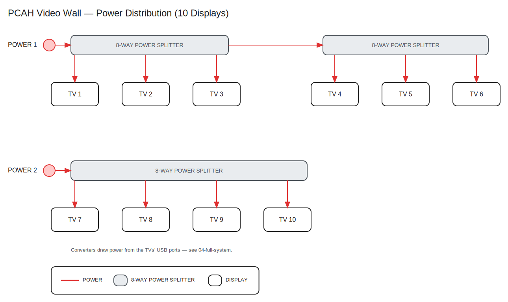
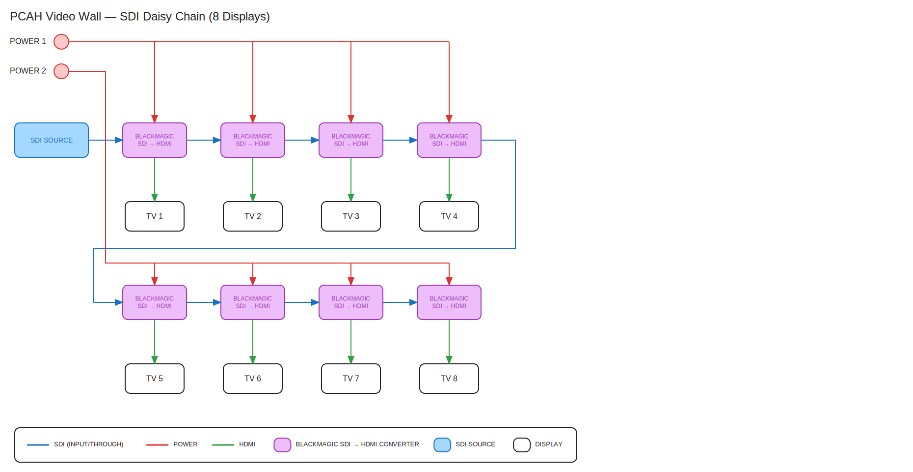
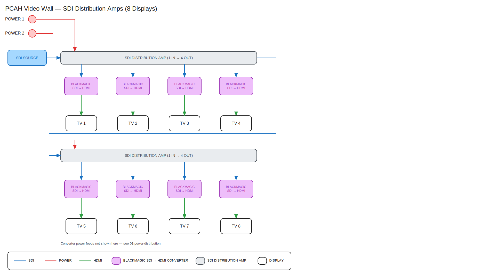

# PCAH Wiring Diagrams

Editable wiring diagrams for the PCAH video wall: an SDI source daisy-chained
through a Blackmagic SDI→HDMI converter at each display, with shared power
distribution. Displays are arranged in three clusters: 3 top-left, 3 top-right,
and 4 below.

How each display is wired:

- **Red** — electric power from the wall feeds, through 8-way power splitters,
  to each TV.
- **Blue** — the SDI video feed, daisy-chained converter to converter through
  their SDI through ports.
- **Green** — HDMI from the converter into the TV.
- **Orange** — USB-A → USB-C cable from the TV's USB port back to the
  converter, which is how the converter gets its power.

Each diagram in `diagrams/` comes in three formats:

| Diagram | What it shows |
|------|---------------|
| `01-power-distribution` | Electric power only: two feeds and three 8-way splitters powering the 10 TVs |
| `02-sdi-daisy-chain` | Earlier 8-display design option: daisy chain with wall-powered converters |
| `03-sdi-distribution-amps` | Earlier 8-display design option: SDI source into 1→4 distribution amps |
| `04-full-system` | The whole system: power, SDI daisy chain, HDMI, and USB power for all 10 displays |

## Full system



## Power distribution



<details>
<summary>Earlier 8-display design options (02, 03)</summary>





</details>

## Formats and editing

- **`.excalidraw`** — open at [excalidraw.com](https://excalidraw.com) (File → Open, or
  drag the file in), in VS Code with the Excalidraw extension, or in Obsidian.
- **`.drawio`** — open at [app.diagrams.net](https://app.diagrams.net) or in the
  draw.io desktop app.
- **`.svg`** — read-only export, embedded above and viewable in any browser.

The formats don't sync with each other: all three are generated from the same
script, so a hand edit in one format won't appear in the others (or survive a
regeneration).

## Regenerating from code

The files are produced by [generate_diagrams.py](generate_diagrams.py) (standard
library only), which is the easiest way to make structural changes like adding a
display column or re-spacing a row:

```sh
python3 generate_diagrams.py
```

Hand edits made in Excalidraw are fine too — just know that re-running the script
overwrites the files.

## Notes on the source material

These were redrawn from photos of AI-rendered diagrams plus the original
whiteboard sketch. A few things were tidied along the way:

- The source legends mislabeled colors (e.g. red marked as "POWER (3G/HD/SD-SDI)").
  Here red is always electric power, blue is always SDI, green is always HDMI,
  and orange is the USB power run from TV to converter.
- The whiteboard sketch drew HDMI and USB power as one green squiggle; they are
  separate lines here since they run in opposite directions.
- `02` and `03` predate the final design (they show 8 displays with wall-powered
  converters, and `03` is the distribution-amp alternative to daisy-chaining).
  They are kept for reference; `01` and `04` reflect the current plan.
